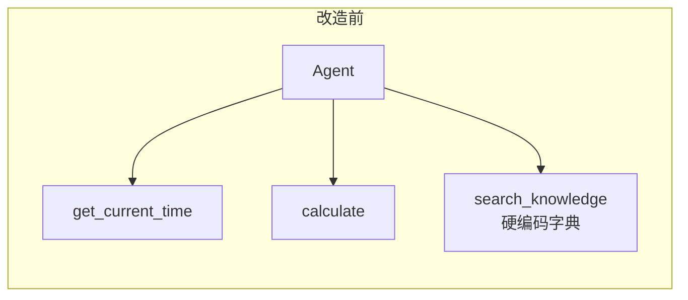
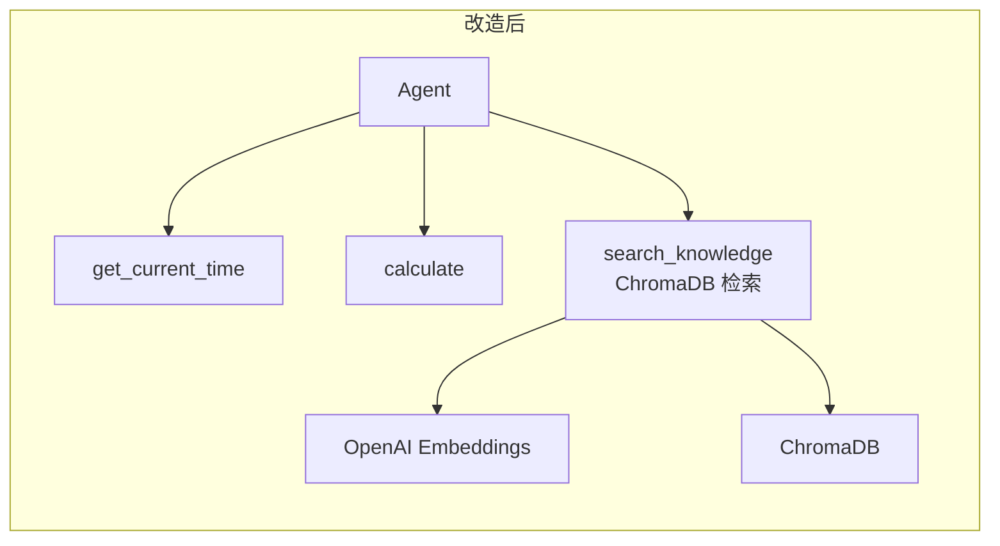
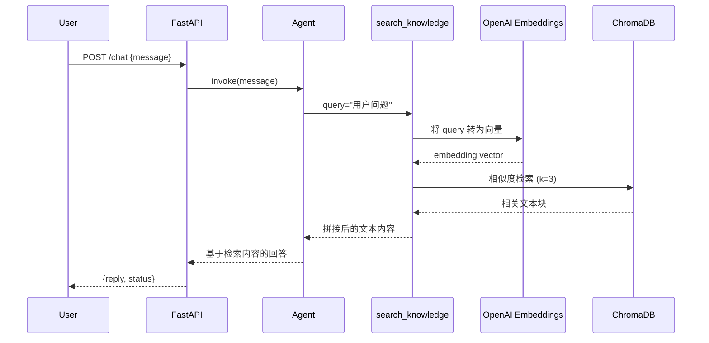

# 技术设计文档：RAG Knowledge Tool

## 概述

本设计将 `rag-agent` 中基于 ChromaDB 的向量检索能力封装为 LangChain `@tool`，替换 `fastapi-agent/tools.py` 中硬编码的 `search_knowledge` 工具。改造后，Agent 可通过语义检索从本地文档知识库中获取真实内容，而非返回预定义的字典匹配结果。

核心改动范围：
- `fastapi-agent/tools.py`：移除硬编码的 `search_knowledge`，新增基于 ChromaDB 的 `search_knowledge` 工具
- `fastapi-agent/requirements.txt`：添加 `chromadb`、`langchain-community`、`langchain-text-splitters` 依赖

设计原则：
- 最小改动：仅修改 `tools.py` 和 `requirements.txt`，`agent.py` 和 `main.py` 无需变更
- 复用现有模式：沿用 `rag-agent/query.py` 中已验证的 ChromaDB + OpenAI Embeddings 检索模式
- 保持接口兼容：工具函数签名和 `ALL_TOOLS` 导出方式不变，`agent.py` 的 `from tools import ALL_TOOLS` 无需修改

## 架构

### 改造前后对比





### 数据流



## 组件与接口

### 修改文件：`fastapi-agent/tools.py`

移除旧的 `search_knowledge` 函数，新增基于 ChromaDB 的实现。

#### 新增函数：`_get_retriever()`

内部辅助函数，负责初始化 ChromaDB 连接和 Retriever。使用模块级缓存避免重复初始化。

```python
def _get_retriever():
    """
    初始化并返回 ChromaDB Retriever（带模块级缓存）。
    
    Returns:
        Chroma retriever 实例
    Raises:
        FileNotFoundError: ChromaDB 路径不存在
        Exception: Embedding 或 ChromaDB 初始化失败
    """
```

#### 修改函数：`search_knowledge(query: str) -> str`

替换为基于 ChromaDB 的实现，保持函数签名不变。

```python
@tool
def search_knowledge(query: str) -> str:
    """
    从本地文档知识库中检索信息，适用于需要查找技术文档、教程、指南等知识性问题。
    参数 query: 用户的查询问题
    """
```

### 不变文件

- `fastapi-agent/agent.py`：无需修改，`from tools import ALL_TOOLS` 保持兼容
- `fastapi-agent/main.py`：无需修改，HTTP 接口层不受影响
- `rag-agent/`：不修改任何文件，仅复用其 ChromaDB 数据

## 数据模型

### 环境变量配置

| 变量名 | 用途 | 默认值 | 必填 |
|--------|------|--------|------|
| `CHROMA_PATH` | ChromaDB 数据存储路径 | `../rag-agent/chroma_db` | 否 |
| `OPENAI_EMBEDDING_MODEL` | Embedding 模型名称 | `text-embedding-3-small` | 否 |
| `OPENAI_API_KEY` | OpenAI API 密钥 | 无 | 是 |
| `OPENAI_BASE_URL` | OpenAI API 基础 URL | 无 | 否 |

### Retriever 配置

| 参数 | 值 | 说明 |
|------|-----|------|
| `search_kwargs.k` | 3 | 每次检索返回最相关的 3 个文本块 |

### 工具返回格式

- 正常返回：多个文本块以 `\n\n---\n\n` 分隔拼接
- 无结果返回：`"未找到与 '{query}' 相关的内容"`
- 错误返回：
  - DB 不存在：`"知识库未初始化，请先运行文档入库脚本（python ingest.py）"`
  - API 失败：`"知识库检索服务暂时不可用，请稍后再试"`
  - 其他异常：`"知识库检索出错: {错误描述}"`

## 正确性属性（Correctness Properties）

*属性（Property）是指在系统所有合法执行中都应成立的特征或行为——本质上是对系统应做什么的形式化陈述。属性是人类可读规格说明与机器可验证正确性保证之间的桥梁。*

### Property 1：检索结果格式化

*For any* 非空的文档块列表，`search_knowledge` 返回的字符串应将各文本块以 `\n\n---\n\n` 分隔符拼接，且拼接后的字符串包含每个原始文本块的完整内容。

**Validates: Requirements 2.3**

### Property 2：检索结果数量上限

*For any* 包含 N 个文档（N ≥ 3）的 ChromaDB 数据库和任意查询字符串，`search_knowledge` 返回的文本块数量应不超过 3 个。

**Validates: Requirements 2.4**

### Property 3：环境变量配置生效

*For any* 环境变量 `CHROMA_PATH` 和 `OPENAI_EMBEDDING_MODEL` 的合法值，工具初始化时应使用环境变量提供的值而非默认值。

**Validates: Requirements 3.1, 3.3**

### Property 4：数据库不存在时的错误处理

*For any* 不存在的文件路径作为 `CHROMA_PATH`，`search_knowledge` 应返回包含"入库脚本"提示的错误信息字符串，而非抛出异常。

**Validates: Requirements 4.1, 4.3**

### Property 5：异常捕获不泄露

*For any* 检索过程中抛出的异常，`search_knowledge` 应捕获该异常并返回包含错误描述的字符串，函数调用不应抛出任何异常。

**Validates: Requirements 4.3**

## 错误处理

### 错误分类与处理策略

| 错误场景 | 检测方式 | 处理方式 | 返回信息 |
|----------|----------|----------|----------|
| ChromaDB 路径不存在 | `os.path.exists()` 检查 | 返回友好提示 | `"知识库未初始化，请先运行文档入库脚本（python ingest.py）"` |
| OpenAI Embedding API 失败 | 捕获 API 相关异常 | 返回服务不可用提示 | `"知识库检索服务暂时不可用，请稍后再试"` |
| 其他未预期异常 | 顶层 `except Exception` | 捕获并返回描述 | `"知识库检索出错: {错误描述}"` |
| 检索结果为空 | 检查返回文档列表长度 | 返回未找到提示 | `"未找到与 '{query}' 相关的内容"` |

### 错误处理实现模式

```python
@tool
def search_knowledge(query: str) -> str:
    try:
        retriever = _get_retriever()  # 可能抛出 FileNotFoundError
        docs = retriever.invoke(query)
        if not docs:
            return f"未找到与 '{query}' 相关的内容"
        return "\n\n---\n\n".join([doc.page_content for doc in docs])
    except FileNotFoundError:
        return "知识库未初始化，请先运行文档入库脚本（python ingest.py）"
    except Exception as e:
        if "openai" in str(type(e).__module__).lower() or "api" in str(e).lower():
            return "知识库检索服务暂时不可用，请稍后再试"
        return f"知识库检索出错: {e}"
```

关键设计决策：所有错误均以字符串形式返回，不抛出异常。这是因为 LangChain Agent 会将工具返回值作为上下文传递给 LLM，LLM 可以基于错误信息向用户给出有意义的回复。

## 测试策略

### 双重测试方法

本特性采用单元测试 + 属性测试的双重策略：

- **单元测试**：验证具体示例、边界情况和错误条件
- **属性测试**：验证跨所有输入的通用属性

### 属性测试

使用 `hypothesis` 库进行属性测试，每个属性测试至少运行 100 次迭代。

每个测试需通过注释引用设计文档中的属性：

```python
# Feature: rag-knowledge-tool, Property 1: 检索结果格式化
# Feature: rag-knowledge-tool, Property 2: 检索结果数量上限
```

属性测试覆盖：

| 属性 | 测试内容 | 生成策略 |
|------|----------|----------|
| Property 1 | 文本块列表格式化 | 生成随机非空字符串列表，验证分隔符拼接 |
| Property 2 | 结果数量上限 | 使用 mock ChromaDB 返回不同数量的文档，验证 ≤ 3 |
| Property 3 | 环境变量配置 | 生成随机路径和模型名称字符串，验证配置读取 |
| Property 4 | DB 不存在错误 | 生成随机不存在路径，验证返回错误信息而非异常 |
| Property 5 | 异常捕获 | 生成随机异常类型，mock 检索过程抛出异常，验证返回字符串 |

### 单元测试

单元测试覆盖以下场景：

- 工具使用 `@tool` 装饰器且接受 `query` 参数（需求 1.1）
- 工具描述包含预期文本（需求 1.2）
- `CHROMA_PATH` 未设置时使用默认路径（需求 3.2）
- `OPENAI_EMBEDDING_MODEL` 未设置时使用默认值（需求 3.4）
- `ALL_TOOLS` 包含三个工具（需求 6.1）
- `search_knowledge` 不再使用硬编码字典（需求 6.3）
- Embedding API 失败时返回特定错误信息（需求 4.2）
- `requirements.txt` 包含所需依赖（需求 5.1, 5.2, 5.3）

### 测试框架

- 测试框架：`pytest`
- 属性测试库：`hypothesis`
- Mock 工具：`unittest.mock`（用于隔离 ChromaDB 和 OpenAI API 调用）
